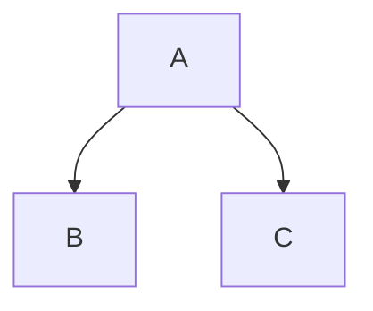

# Fumadocs Framework: Mermaid
URL: /docs/ui/markdown/mermaid
Source: https://raw.githubusercontent.com/fuma-nama/fumadocs/refs/heads/main/apps/docs/content/docs/ui/markdown/mermaid.mdx

Rendering diagrams in your docs
        


Fumadocs doesn't have a built-in Mermaid wrapper provided, we recommend using `mermaid` directly.

## Setup

Install the required dependencies, `next-themes` is used with Fumadocs to manage the light/dark mode.

<CodeBlockTabs defaultValue="npm" groupId="package-manager" persist>
  <CodeBlockTabsList>
    <CodeBlockTabsTrigger value="npm">
      npm
    </CodeBlockTabsTrigger>

    <CodeBlockTabsTrigger value="pnpm">
      pnpm
    </CodeBlockTabsTrigger>

    <CodeBlockTabsTrigger value="yarn">
      yarn
    </CodeBlockTabsTrigger>

    <CodeBlockTabsTrigger value="bun">
      bun
    </CodeBlockTabsTrigger>
  </CodeBlockTabsList>

  <CodeBlockTab value="npm">
    ```bash
    npm install mermaid next-themes
    ```
  </CodeBlockTab>

  <CodeBlockTab value="pnpm">
    ```bash
    pnpm add mermaid next-themes
    ```
  </CodeBlockTab>

  <CodeBlockTab value="yarn">
    ```bash
    yarn add mermaid next-themes
    ```
  </CodeBlockTab>

  <CodeBlockTab value="bun">
    ```bash
    bun add mermaid next-themes
    ```
  </CodeBlockTab>
</CodeBlockTabs>

Create the Mermaid component:

```tsx title="components/mdx/mermaid.tsx"
'use client';

import { use, useEffect, useId, useState } from 'react';
import { useTheme } from 'next-themes';

export function Mermaid({ chart }: { chart: string }) {
  const [mounted, setMounted] = useState(false);

  useEffect(() => {
    setMounted(true);
  }, []);

  if (!mounted) return;
  return <MermaidContent chart={chart} />;
}

const cache = new Map<string, Promise<unknown>>();

function cachePromise<T>(
  key: string,
  setPromise: () => Promise<T>,
): Promise<T> {
  const cached = cache.get(key);
  if (cached) return cached as Promise<T>;

  const promise = setPromise();
  cache.set(key, promise);
  return promise;
}

function MermaidContent({ chart }: { chart: string }) {
  const id = useId();
  const { resolvedTheme } = useTheme();
  const { default: mermaid } = use(
    cachePromise('mermaid', () => import('mermaid')),
  );

  mermaid.initialize({
    startOnLoad: false,
    securityLevel: 'loose',
    fontFamily: 'inherit',
    themeCSS: 'margin: 1.5rem auto 0;',
    theme: resolvedTheme === 'dark' ? 'dark' : 'default',
  });

  const { svg, bindFunctions } = use(
    cachePromise(`${chart}-${resolvedTheme}`, () => {
      return mermaid.render(id, chart.replaceAll('\\n', '\n'));
    }),
  );

  return (
    <div
      ref={(container) => {
        if (container) bindFunctions?.(container);
      }}
      dangerouslySetInnerHTML={{ __html: svg }}
    />
  );
}

```

> This is originally inspired by [remark-mermaid](https://github.com/the-guild-org/docs/blob/main/packages/remark-mermaid/src/mermaid.tsx).

Add the component as a MDX component:

```tsx title="mdx-components.tsx"
import defaultMdxComponents from 'fumadocs-ui/mdx';
import { Mermaid } from '@/components/mdx/mermaid';
import type { MDXComponents } from 'mdx/types';

export function getMDXComponents(components?: MDXComponents): MDXComponents {
  return {
    ...defaultMdxComponents,
    Mermaid, // [!code ++]
    ...components,
  };
}
```

## Usage

Use it in MDX files.

```mdx
<Mermaid
  chart="
graph TD;
subgraph AA [Consumers]
A[Mobile app];
B[Web app];
C[Node.js client];
end
subgraph BB [Services]
E[REST API];
F[GraphQL API];
G[SOAP API];
end
Z[GraphQL API];
A --> Z;
B --> Z;
C --> Z;
Z --> E;
Z --> F;
Z --> G;"
/>
```

<Tabs items={['Diagram', 'User Journey']}>
  <Tab>
    <Mermaid
      chart="

graph TD;
subgraph AA [Consumers]
A[Mobile app];
B[Web app];
C[Node.js client];
end
subgraph BB [Services]
E[REST API];
F[GraphQL API];
G[SOAP API];
end
Z[GraphQL API];
A --> Z;
B --> Z;
C --> Z;
Z --> E;
Z --> F;
Z --> G;"
    />
  </Tab>

  <Tab>
    <Mermaid
      chart="

journey
title My working day
section Go to work
Make tea: 5: Me
Go upstairs: 3: Me
Do work: 1: Me, Cat
section Go home
Go downstairs: 5: Me
Sit down: 5: Me
"
    />
  </Tab>
</Tabs>

### As CodeBlock

You can convert `mermaid` codeblocks into the MDX usage with the `remarkMdxMermaid` remark plugin.

<CodeBlockTabs defaultValue="Fumadocs MDX">
  <CodeBlockTabsList>
    <CodeBlockTabsTrigger value="Fumadocs MDX">
      Fumadocs MDX
    </CodeBlockTabsTrigger>
  </CodeBlockTabsList>

  <CodeBlockTab value="Fumadocs MDX">
    ```tsx  title="source.config.ts"
    import { remarkMdxMermaid } from 'fumadocs-core/mdx-plugins';
    import { defineConfig } from 'fumadocs-mdx/config';

    export default defineConfig({
      mdxOptions: {
        remarkPlugins: [remarkMdxMermaid],
      },
    });
    ```
  </CodeBlockTab>
</CodeBlockTabs>

````md

````
